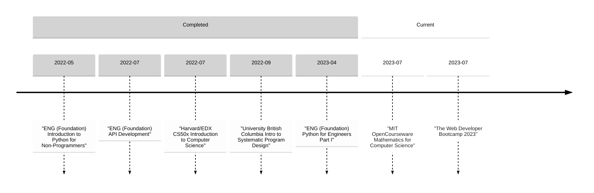

# My Learning Journey

**More of my coding work**
- [My Wife's Professional Portfolio Website](https://www.davinafaye.com)
- [A Security Ops Starter script for customers at Cisco Umbrella.](https://github.com/CiscoDevNet/cloud-security/tree/master/Umbrella/Samples/SOCTools/NSD_Recheck)
- [My Cisco Github](https://github.com/ccardina)

**Languages**
- Python
- SQL
- HTML, CSS, JS
- C, during CS50.
- SQL

**Software Company Resume**

[Linkedin](https://www.linkedin.com/in/cody-cardinal-896b661b/)

> **Cisco** 4yrs, 5mo
- Technical Leader | Present, 10mo
- Team Leader | 2yrs, 8mo
- Technical Account Manager | 1yr, 1mo
- Tags: Cisco Umbrella, DNS, Security, SaaS, CX, TAM, Account Management

> **Cygilant** 3yr, 6mo
- Cybersecurity Advisor 1yr
- Service Delivery Manager 2yr, 6mo
- Tags: Security Operations Center, SaaS, Security, SIEM, Logging, CX, Startup, TAM, SDM, Account Management

> **Sophos** 4yr, 2mo
- Technical Support Account Manager | 3yr, 8mo
- Technical Support Engineer | 6mo
- Tags: Security, Endpoint, CX, Support, Account Management
