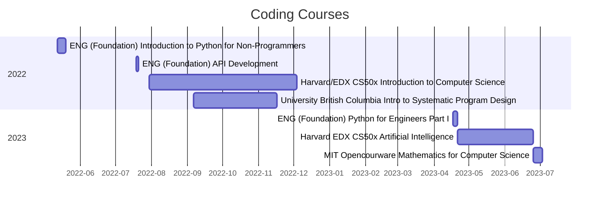

# My-Learning-Journey (WIP)

**Current Learning**
- Harvard EDX CS50x Artificial Intelligence: Started 2023-06-25
- MIT Opencourware Mathematics for Computer Science: Started 2023-07-03

**Languages** 
- Python
- SQL
- HTML, CSS, JS
- C, during CS50.
- SQL
