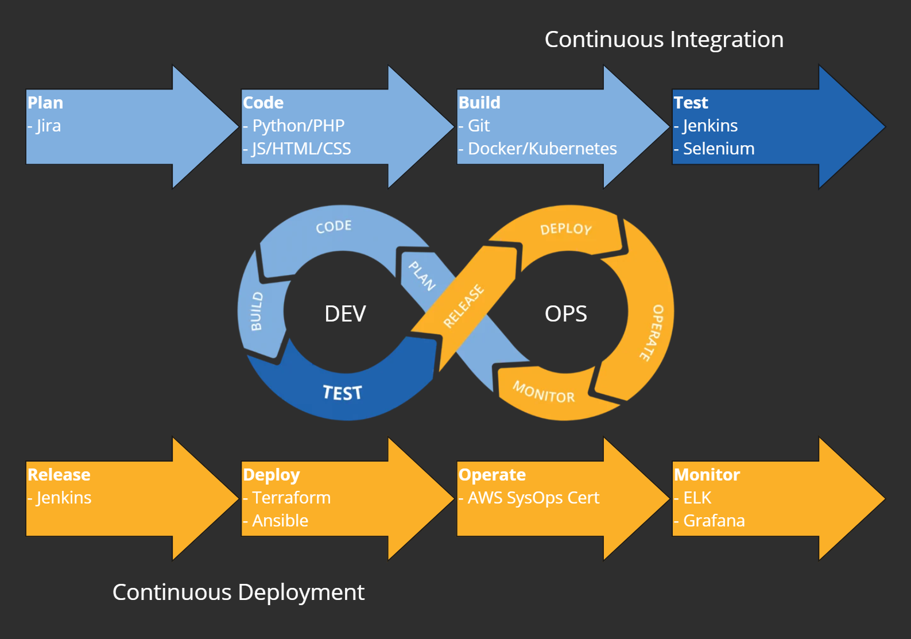

# My Learning Journey

## **Current**
- **October 2023:** 
- **September 2023:** [PHPandMySQL Book by John Duckett](https://phpandmysql.com/) | PHP
- **July 2023:** [MIT OpenCourseware Mathematics for Computer Science](https://ocw.mit.edu/courses/6-042j-mathematics-for-computer-science-fall-2010/) | Discrete Mathematics

### **Next**
- [Harvey Mudd College: Digital Design](https://www.edx.org/learn/engineering/harvey-mudd-college-digital-design-2)
- [Harvey Mudd College: Computer Architecture](https://www.edx.org/learn/engineering/harvey-mudd-college-computer-architecture)
- [The University of California, San Diego: Data Structures: An Active Learning Approach](https://www.edx.org/learn/computer-science/the-university-of-california-san-diego-data-structures-an-active-learning-approach)

- **Scheduled:** ENG: (Foundation) Intro to Containers
- **Scheduled:** ENG: (Foundation) Kubernetes and Docker Container Foundations

### **Completed**
- **May 2022:** ENG (Foundation) Introduction to Python for Non-Programmers by [Reuven Lerner](https://twitter.com/reuvenmlerner) | Python
- **July 2022:** ENG (Foundation) API Development | Python, Flask
- **July 2022:** [Harvard/EDX CS50x Introduction to Computer Science](https://www.edx.org/learn/computer-science/harvard-university-cs50-s-introduction-to-computer-science) | C, Python, HTML, CSS, SQL
- **September 2022:** [University British Columbia Intro to Systematic Program Design](https://extendedlearning.ubc.ca/programs/introduction-systematic-program-design-python) | Python, Testing, Function Design
- **April 2023:** [ENG (Foundation) Python for Engineers Part I](https://twitter.com/raymondh) by Raymond Hettinger | Python
- **July 2023:** [The Web Developer Bootcamp 2023](https://www.udemy.com/course/the-web-developer-bootcamp) | HTML, CSS, Bootstrap, Javascript, AJAX, React, Node, MongoDB, and more.
- **September 2023:** [PHP for Complete Beginners](https://www.udemy.com/course/php-for-complete-beginners-includes-msql-object-oriented) | PHP, MYSQL, OOP, Apache
- **September 2023:** [The Complete Modern PHP Developer](https://www.udemy.com/course/complete-modern-php-developer) | PHP
- 
### **Projects**
- [YelpCamp](https://github.com/CodyCardinal/YelpCamp) | Full Stack | Javascript, Node, MongoDB, HTML, CSS, Bootstrap | Heroku Hosting
- [CS50x Final Project](https://github.com/CodyCardinal/CS50Final) | Full Stack | Python, Flask, HTML, CSS, Bootstrap, SQLite
- [www.davinafaye.com](https://www.davinafaye.com) | Full Stack | Python, Flask, NginX, Gunicorn, HTML, CSS, Bootstrap | DigitalOcean Hosting
- [A Security Ops Starter script for Cisco Umbrella Customers](https://github.com/CiscoDevNet/cloud-security/tree/master/Umbrella/Samples/SOCTools/NSD_Recheck) | Python
- [ModernPHP](https://github.com/CodyCardinal/modernphp) | Full Stack | PHP, PHP-FPM, Apache, Docker, MySQL
- [My Cisco Github](https://github.com/ccardina)

**Languages**
- Python, PHP, Javascript
- SQL, MongoDB, MariaDB
- HTML, CSS, Bootstrap, React
- C

**Frameworks and Tools**
- Node, Express, MongoDB
- Flask, SQLite
- Docker, Docker-Compose

**Software Company Experience**
- [LinkedIn](https://www.linkedin.com/in/cody-cardinal-896b661b/)
- **Cisco:** 4 years, 5 months | Technical Account Manager > Team Lead > Technical Leader
- **Cygilant:** 3 years, 6 months | Service Delivery Manager > Cybersecurity Advisor
- **Sophos:** 4 years, 2 months | Technical Support Engineer > Technical Support Account Manager
- And More! IT experience since a high school internship in 2003.
